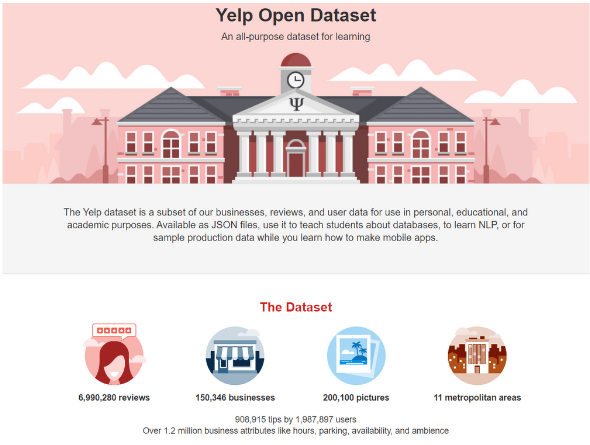
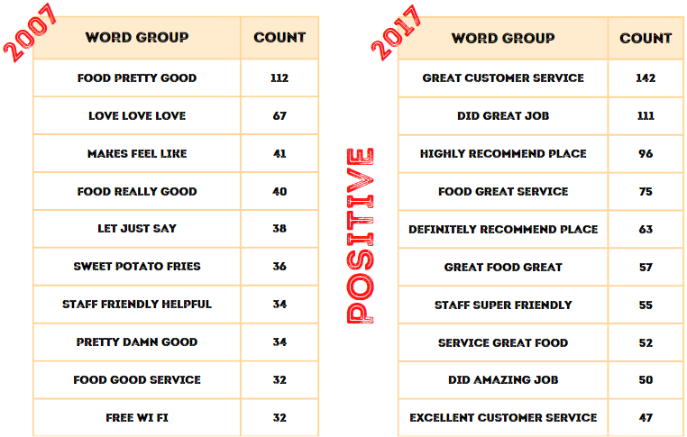
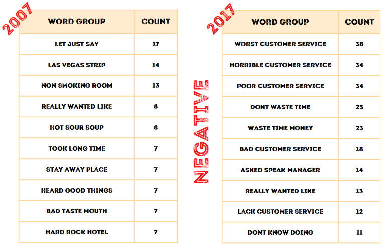
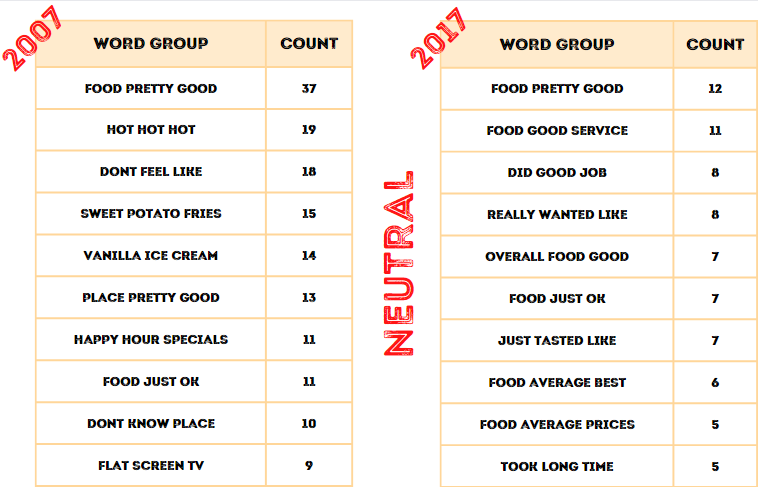

# An NLP Sentiment Analysis using Restaurant Reviews

This repository includes an NLP Project about analyzing the restaurant reviews obtained from Yelp.

## Introduction

**Problem Definition:** 
- What are the parameters that most affect the positive/negative evaluation of customers?
- How have the factors affecting positive/negative evaluations changed over time?

**Solution Recommendation:** 
- Performing a sentiment analysis using the NLP method on review datas from Yelp.

**Objective:** 
- Finding words that positively/negatively influence customer reviews.
- Comparing the results obtained from the NLP method with the comments made in 2007 with the comments made in 2017.

## Dataset

**Webpage:** https://www.yelp.com/dataset

## Methodology

- The Python NLP libraries, and data storages for MongoDB.

- Performing various editing and cleaning operations on the data.

- Performing exploratory data analysis on the cleaned data.

- Performing Count Vectorizer method for detecting the most frequent words in reviews.

## Results
### Results for Positive Sentiment
- In 2007, customers especially paid attention to the taste of the foods for positive voting.
- But in 2017, customers especially paid attention to the quality of customer services for positive voting.

### Results for Negative Sentiment
- In 2007, customers especially paid attention to having non-smoking rooms and service time for negative voting.
- But in 2017, customers especially paid attention again to the quality of customer services for negative voting.

### Results for Neutral Sentiment
- For the neutral sentiment, compared to the previous 2 sentiments, clear results were not found.
- It contains both positive and negative reviews.

